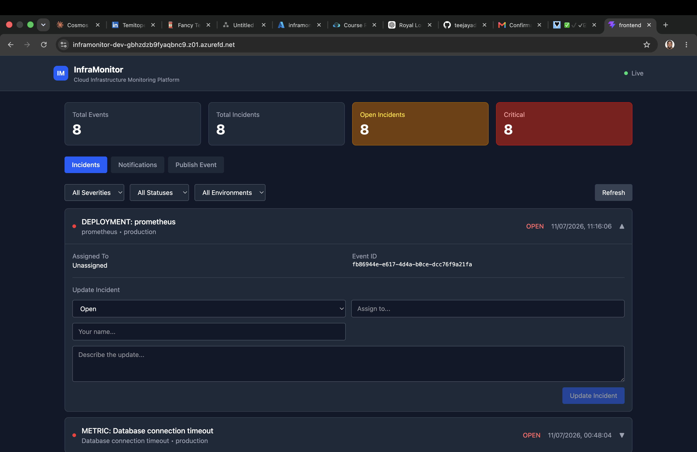
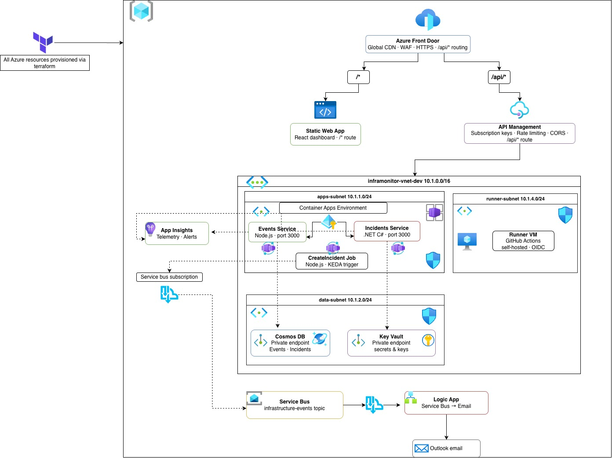

# InfraMonitor


**InfraMonitor** is a cloud infrastructure monitoring and alerting platform built on Azure. It gives
platform and DevOps engineers a single place to publish infrastructure events, automatically turn
the critical ones into tracked incidents, and get notified the moment something needs attention.

## The problem it solves

When something goes wrong in production — a deployment fails, a service goes down, a threshold gets
breached — teams need three things straight away: to know about it, to have a record of it, and to
be able to track it through to resolution. It's common for that to be scattered across a Slack
channel, a spreadsheet and someone's memory. InfraMonitor wires the pieces together into one
pipeline: **event in → incident created → someone notified → status tracked to resolution**, backed
by an auditable record of everything that happened.

**Who it's for:** platform engineers, SREs and DevOps teams who want a lightweight, self-hosted
alternative to point-and-click monitoring SaaS for tracking infrastructure incidents, without giving
up ownership of the data or the pipeline.



## Architecture



All Azure resources shown above are provisioned via Terraform. The request path runs
Browser → Front Door → (APIM → Container Apps → Cosmos DB) or (Static Web App), with critical
events fanning out from Service Bus to the Container Apps incident-creation job and the Logic App
independently. CI/CD is separate from that path: GitHub Actions drives Terraform through the
self-hosted runner inside the VNet, and drives the frontend build/deploy on a standard hosted
runner - see [CI/CD pipeline explanation](#cicd-pipeline-explanation) below for both.

## Tech stack

| Layer | Technology | Purpose |
|---|---|---|
| Frontend | React 19 + TypeScript + Vite + Tailwind CSS | Dashboard for incidents, events and notifications |
| Edge / CDN | Azure Front Door (Standard) | Public HTTPS entry point, routes `/api/*` to APIM and everything else to the static site |
| API Gateway | Azure API Management (Developer tier) | Subscription-key auth, CORS, rate limiting, single façade over both backend services |
| Events service | Node.js + Express | Ingests infrastructure events, writes to Cosmos DB, publishes critical/high-severity events to Service Bus |
| Incidents service | .NET 10 (ASP.NET Core Web API) | Incident CRUD, notification history |
| Incident creation job | Node.js on Azure Container Apps Jobs (KEDA) | Triggered by Service Bus queue depth; turns a critical event into a tracked incident |
| Notifications | Azure Logic Apps (Consumption) | Triggered by its own Service Bus subscription; sends the email and records the notification |
| Data store | Azure Cosmos DB (SQL API) | Events, Incidents and Notifications containers |
| Messaging | Azure Service Bus (Topic + subscriptions) | Fans out critical events to the incident-creation job and the Logic App independently |
| Identity | Azure Managed Identities + Cosmos/Key Vault/Service Bus RBAC | No connection strings or shared keys anywhere in application code |
| Secrets | Azure Key Vault (private endpoint) | Cosmos endpoint, Service Bus namespace, App Insights connection string |
| Container hosting | Azure Container Apps | Runs events-service, incidents-service and the incident-creation job |
| Registry | Azure Container Registry | Stores service images, pulled via managed identity (no admin credentials) |
| Networking | Azure Virtual Network, private endpoints, NSGs | Cosmos DB and Key Vault are not publicly reachable; only the apps/runner subnets can reach them |
| Observability | Application Insights + Log Analytics Workspace | Telemetry from all services, queryable with KQL |
| IaC | Terraform (azurerm ~> 4.0) | The entire platform above, as code |
| CI/CD | GitHub Actions (OIDC, no stored client secret) | Terraform pipeline (self-hosted runner) + frontend pipeline (hosted runner) |
| Reference-only | Go | An earlier notification-service prototype, superseded by the Logic App and kept in the repo for reference |

## Repository structure

```
├── Frontend/                        # React + TypeScript + Vite dashboard
│   └── src/
│       ├── components/              # IncidentsList, EventsList, EventForm, NotificationsList, StatsBar
│       └── services/api.ts          # Axios client for the APIM-fronted APIs
├── Microservices/
│   ├── services/
│   │   ├── events-service/          # Node.js + Express: event ingestion API
│   │   └── incidents-service/       # .NET 10 Web API: incident management API
│   └── functions/
│       ├── incident-function/       # Node.js entrypoint for the Container Apps Job
│       │                            # (creates an incident from a critical event)
│       └── ...
├── Microservices/send-notification-go/  # Go notification prototype (reference only, not deployed)
├── infra/                           # Terraform IaC
│   ├── main.tf                      # Root module wiring every module together
│   ├── modules/
│   │   ├── networking/              # VNet, subnets, NSGs, private DNS zones
│   │   ├── identities/               # User-assigned managed identities
│   │   ├── keyvault/                 # Key Vault + private endpoint + secrets
│   │   ├── cosmos/                   # Cosmos DB account, database, containers, data-plane RBAC
│   │   ├── servicebus/               # Namespace, topic, subscriptions, RBAC
│   │   ├── container_registry/       # ACR + pull role assignments
│   │   ├── container_apps/           # Container Apps environment, events/incidents apps, the incident job
│   │   ├── apim/                     # APIM instance, APIs, backends, CORS/rate-limit policies
│   │   ├── frontdoor/                # Front Door profile, endpoint, origins, routes
│   │   ├── frontend/                 # Static Web App
│   │   ├── logic_app/                # Logic App workflow + RBAC
│   │   ├── observability/            # Log Analytics + Application Insights
│   │   ├── runner/                   # Self-hosted GitHub Actions runner VM
│   │   └── functions/                # Azure Functions module (currently disabled - see note below)
│   └── backend.tf, variables.tf, outputs.tf, terraform.tfvars
└── .github/workflows/
    ├── terraform.yml                 # Plan on PR / apply on main, via the self-hosted runner
    └── deploy-frontend.yml           # Build and deploy the React app to Static Web Apps
```

> **Note:** `infra/modules/functions/` exists in the codebase but is currently commented out in
> `main.tf` - the subscription this was built against hit an Azure App Service Plan quota limit
> (`Current Limit (Total VMs): 0`) unrelated to the code itself. The incident-creation workload
> that would have used it now runs as a KEDA-scaled Container Apps Job instead.

## Prerequisites

- An Azure subscription with permission to create resource groups, service principals and the
  resources listed above
- A GitHub account (for Actions, OIDC federation and Secrets/Variables)
- Locally: [Terraform](https://developer.hashicorp.com/terraform) 1.9+, [Docker](https://www.docker.com/)
  (or just `az acr build`, which doesn't need a local daemon), [Node.js](https://nodejs.org/) 20,
  the [.NET 10 SDK](https://dotnet.microsoft.com/), [Go](https://go.dev/) 1.26+ (only if touching the
  reference notification service), and the [Azure CLI](https://learn.microsoft.com/cli/azure/)

## Getting started

1. **Clone the repository**
   ```bash
   git clone https://github.com/<your-org>/Cloud-Infrastructure-Monitoring-Alerting-Platform.git
   cd Cloud-Infrastructure-Monitoring-Alerting-Platform
   ```

2. **Set up an Azure service principal for Terraform**, using OIDC / workload identity federation
   rather than a client secret. Create an app registration, then add federated credentials trusting
   GitHub's OIDC issuer for your repo (see `.github/workflows/README.md` for the exact `az ad app
   federated-credential create` commands). Grant it Contributor on the target subscription (or
   resource group, if you're scoping it tighter).

3. **Configure GitHub Secrets and Variables** under *Settings → Secrets and variables → Actions* -
   see the [reference table](#environment-variables--github-secrets-reference) below for the full
   list.

4. **Run Terraform** to provision the platform:
   ```bash
   cd infra
   terraform init
   terraform plan
   terraform apply
   ```
   Locally, if Key Vault/Cosmos DB have public network access disabled, add your own egress IP via
   `-var 'keyvault_allowed_ip_ranges=["<your-ip>/32"]' -var 'cosmos_allowed_ip_ranges=["<your-ip>/32"]'`
   (the self-hosted CI runner doesn't need this - it reaches both over their private endpoints).

5. **Build and push the container images** - either with a local Docker daemon, or with
   `az acr build` (no daemon required):
   ```bash
   az acr build --registry <your-acr-name> --image events-service:v1 --file Dockerfile . \
     --resource-group <rg> \
     # (run from Microservices/services/events-service, and similarly for incidents-service
     #  and Microservices/functions/incident-function)
   ```

6. **Register the self-hosted GitHub Actions runner.** After `terraform apply` creates the runner
   VM, it still needs registering with GitHub once - reach it via Bastion or a jump host inside the
   VNet, grab a registration token from *Settings → Actions → Runners → New self-hosted runner*, and
   run `config.sh` followed by installing it as a service. Full steps are in
   `infra/modules/runner/outputs.tf`.

7. **Deploy the frontend** - push a change under `Frontend/**` (or run the workflow manually via
   *Actions → Deploy Frontend to Azure Static Web Apps → Run workflow*). The build step injects
   `VITE_APIM_BASE` and `VITE_APIM_KEY` so the deployed app talks to Front Door → APIM directly.

## Environment variables / GitHub secrets reference

**GitHub Secrets** (*Settings → Secrets and variables → Actions → Secrets*):

| Secret | Used by | Value |
|---|---|---|
| `ARM_CLIENT_ID` | Terraform pipeline | Service principal / app registration client ID |
| `ARM_TENANT_ID` | Terraform pipeline | Azure AD tenant ID |
| `ARM_SUBSCRIPTION_ID` | Terraform pipeline | Azure subscription ID |
| `TF_VAR_current_user_object_id` | Terraform pipeline | Azure AD object ID of the human operator (granted Key Vault Secrets Officer) |
| `TF_VAR_terraform_sp_object_id` | Terraform pipeline | Object ID of the Terraform service principal itself (also granted Key Vault Secrets Officer) |
| `TF_VAR_runner_ssh_public_key` | Terraform pipeline | SSH public key for the self-hosted runner VM |
| `VITE_APIM_KEY` | Frontend pipeline | APIM subscription key, baked into the build so the deployed app can call the APIs |
| `AZURE_STATIC_WEB_APPS_API_TOKEN` | Frontend pipeline | Deployment token for the Static Web App |

**GitHub repository Variables** (*Settings → Secrets and variables → Actions → Variables* - not
sensitive):

| Variable | Example value | Notes |
|---|---|---|
| `TF_VAR_PUBLISHER_EMAIL` | `you@example.com` | APIM publisher email |
| `TF_VAR_ENVIRONMENT` | `dev` | Environment suffix used throughout resource names |
| `TF_VAR_LOCATION` | `uksouth` | Primary Azure region |
| `TF_VAR_PROJECT` | `inframonitor` | Project name prefix |
| `TF_VAR_CREATE_APIM` | `true` | APIM (Developer tier) is slow to provision and costs money continuously - set `false` to skip it |
| `TF_VAR_CREATE_FRONTDOOR` | `true` | Requires `TF_VAR_CREATE_APIM = true` |
| `TF_VAR_KEYVAULT_ALLOWED_IP_RANGES` | `[]` | Public IP allow-list for Key Vault's firewall - empty because CI reaches it via private endpoint |
| `TF_VAR_COSMOS_ALLOWED_IP_RANGES` | `[]` | Same, for Cosmos DB |

No client secret is required anywhere in the Terraform pipeline - both `azure/login@v2` and the
`azurerm` provider authenticate via the federated OIDC credential above.

## API reference

All endpoints are published through APIM at `https://<front-door-endpoint>/api/<api-path>/...`.

**Events API** (`events-api`, Node.js / events-service)

| Method | Path | Description |
|---|---|---|
| `POST` | `/events` | Publish a new infrastructure event; publishes to Service Bus automatically if severity is `critical` or `high` |
| `GET` | `/events` | List events, optionally filtered by `environment`, `severity`, `type` |
| `GET` | `/events/:id` | Get a single event by ID |

**Incidents API** (`incidents-api`, .NET / incidents-service)

| Method | Path | Description |
|---|---|---|
| `POST` | `/incidents` | Create an incident directly |
| `GET` | `/incidents` | List incidents, optionally filtered by `severity`, `status`, `environment` |
| `GET` | `/incidents/{id}` | Get a single incident (requires `severity` query parameter, used as the Cosmos DB partition key) |
| `PATCH` | `/incidents/{id}` | Update incident status / assignment (requires `severity` query parameter) |
| `GET` | `/notifications` | List the 50 most recent notifications sent by the Logic App |

## CI/CD pipeline explanation

Two independent GitHub Actions workflows cover this repository - one for infrastructure, one for
the frontend. Neither triggers the other.

**Terraform pipeline (`terraform.yml`)**
- Triggers on any push or pull request touching `infra/**`, plus manual dispatch
- Runs on the **self-hosted runner** living inside the VNet, so it can reach Key Vault and Cosmos DB
  through their private endpoints
- Authenticates to Azure via **OIDC** - no client secret is stored anywhere
- `terraform-plan`: `init` → `fmt -check` (non-blocking) → `validate` → `plan`, saving the plan as a
  build artifact and posting it as a PR comment when the trigger is a pull request
- `terraform-apply`: runs only on `main`, only after `terraform-plan` succeeds, and applies the
  *exact plan artifact* produced by that same run - not a fresh plan - so what gets applied is
  always what was reviewed
- There's no manual approval gate and no way to run apply without a matching plan from the same run

**Frontend pipeline (`deploy-frontend.yml`)**
- Triggers on any push touching `Frontend/**` or the workflow file itself, plus manual dispatch
- Runs on a standard GitHub-hosted `ubuntu-latest` runner (no VNet access needed - it only talks to
  npm and the Static Web Apps deploy API)
- Installs dependencies, builds with Vite (injecting `VITE_APIM_BASE` and `VITE_APIM_KEY` as build-time
  environment variables), then deploys the built `dist/` folder straight to Azure Static Web Apps

## Architecture decisions

- **Managed identity everywhere, no stored secrets.** Every service-to-Azure connection - Cosmos DB,
  Service Bus, Key Vault, ACR - authenticates via a user-assigned managed identity and Azure RBAC
  (or Cosmos's own data-plane RBAC). The only credential-shaped things in the whole system are the
  Front Door → APIM subscription key (an intentional, low-privilege API contract) and the runner's
  SSH key.
- **Container Apps over AKS.** Two small stateless HTTP services and one event-triggered job don't
  need a Kubernetes control plane to manage. Container Apps gives managed scaling (including
  scale-to-zero via KEDA for the incident job) with a fraction of the operational surface area.
- **Self-hosted runner inside the VNet.** Key Vault and Cosmos DB have public network access
  disabled and are only reachable via private endpoint. Rather than punching firewall holes for
  GitHub-hosted runners' ever-changing IP ranges, a small VM inside the VNet runs the Terraform
  pipeline with no public IP of its own.
- **Front Door + APIM together, not just one.** Front Door provides the global HTTPS edge, a stable
  public hostname and (optionally) a custom domain in front of both the API and the static site.
  APIM sits behind it as the actual API contract layer - subscription keys, CORS, rate limiting and
  per-operation policy - which Front Door alone doesn't provide.
- **Polyglot by design, not by accident.** events-service (Node.js) and incidents-service (.NET) are
  independent services with independent lifecycles, deliberately built in different stacks to keep
  each service's footprint honest and to reflect a realistic team where different services are
  owned by different people with different tooling preferences.

## Monitoring

- **Application Insights** is wired up across the services via the Application Insights SDK/connection
  string (delivered through Key Vault), giving request, dependency and exception telemetry per service.
- **Log Analytics Workspace** is the backing store for that telemetry - open it in the Azure Portal
  and query with KQL, e.g.:
  ```kusto
  requests
  | where success == false
  | summarize count() by cloud_RoleName, resultCode
  | order by count_ desc
  ```
- **Alerting** is not yet wired up as Terraform-managed resources (no `azurerm_monitor_metric_alert`
  / action groups exist in `infra/modules/observability/` today) - Application Insights and Log
  Analytics are in place as the foundation, but configuring alert rules on top is a natural next
  step, either in the portal or as an addition to the `observability` module.

## Contributing / development

**Running services locally**
- `events-service`: `cd Microservices/services/events-service && npm install && npm run dev`
  (needs `COSMOS_ENDPOINT` and Service Bus config in a local `.env` - see `.env` handling in
  `azureConfig.js`; never commit this file, it's gitignored)
- `incidents-service`: `cd Microservices/services/incidents-service && dotnet run`
- `Frontend`: `cd Frontend && npm install && npm run dev` (set `VITE_APIM_BASE` / `VITE_APIM_KEY` in
  a local `.env` to point at deployed APIs, or run the backend services locally too)

**Adding a new service**
1. Add the service under `Microservices/services/<name>/` with its own `Dockerfile`
2. Add a matching user-assigned identity in `infra/modules/identities/`
3. Add the Container App in `infra/modules/container_apps/`, granting it only the RBAC roles it
   needs (Cosmos data-plane role, Service Bus role, ACR pull, Key Vault secrets user)
4. If it needs to be publicly reachable, add an API + backend + policy in `infra/modules/apim/`

**Adding a new environment (e.g. staging, prod)**
1. Give it its own Terraform state key in `infra/backend.tf` (or via `-backend-config`) so it
   doesn't share state with `dev`
2. Add a parallel set of `TF_VAR_*` GitHub Variables/Secrets (a GitHub *environment* with scoped
   secrets works well here)
3. Duplicate or parameterise the jobs in `terraform.yml` to point at the new state key and variables
4. Use a separate federated credential and service principal per environment rather than reusing one
   trust relationship across environments with different blast radii

## Licence

Distributed under the MIT Licence. See [`LICENSE`](LICENSE) for details.
