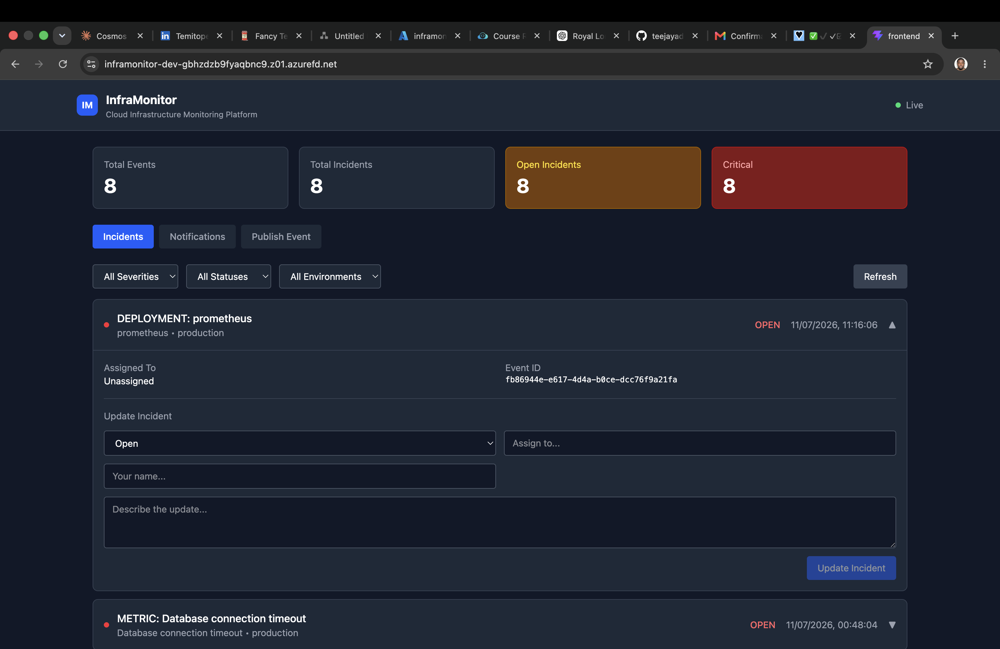
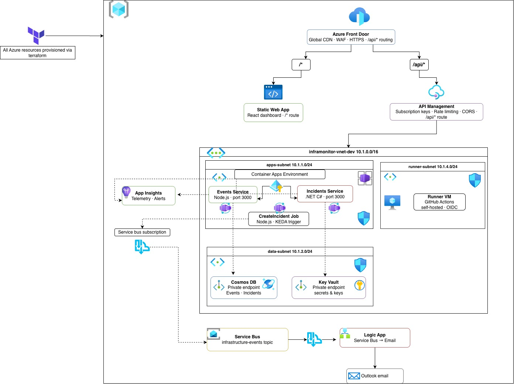

# InfraMonitor


**InfraMonitor** is a cloud infrastructure monitoring and alerting platform: a single place to
publish infrastructure events, automatically turn the critical ones into tracked incidents, and get
notified the moment something needs attention. This README covers the platform end to end; the
CI/CD system that builds, tests, scans, and deploys it is documented in full, with real numbers and
real engineering reasoning, in **[docs/CICD.md](docs/CICD.md)**.

## The problem it solves

When something goes wrong in production — a deployment fails, a service goes down, a threshold gets
breached — teams need three things straight away: to know about it, to have a record of it, and to
be able to track it through to resolution. InfraMonitor wires the pieces together into one
pipeline: **event in → incident created → someone notified → status tracked to resolution**.



## Platform architecture

The application services run on **Azure Kubernetes Service** (`inframonitor-aks`), deployed and
kept in sync entirely through GitOps — no `kubectl apply` in the deploy path, ever:

- **ArgoCD** (app-of-apps pattern: one `inframonitor-root` Application points at `charts/apps` in
  the separate [`inframonitor-gitops`](https://github.com/teejayade2244/inframonitor-gitops) repo,
  which in turn defines one ArgoCD `Application` per service per environment) — every Deployment,
  every RBAC binding, every image tag change lands as a Git commit first; ArgoCD's `selfHeal` then
  reconciles the cluster to match, automatically and continuously.
- **KEDA** scales `create-incident-job` from zero based on Service Bus queue depth — it's a
  `ScaledJob`, not a long-running Deployment, so it costs nothing to run when there's nothing to
  process.
- **kube-prometheus-stack** (Prometheus + Grafana + Alertmanager) provides cluster and workload
  metrics, running in the `monitoring` namespace.
- Two environments, `inframonitor` (staging) and `inframonitor-production`, each with its own
  namespace and its own ArgoCD Applications per service.

Two backend services and one background job make up the application layer:

| Service | Stack | Role |
|---|---|---|
| `events-service` | Node.js + Express | Ingests infrastructure events, writes to Cosmos DB, publishes critical/high-severity events to Service Bus |
| `incidents-service` | .NET 10 (ASP.NET Core Web API) | Incident CRUD |
| `create-incident-job` | Node.js, KEDA-scaled Container Apps-style job on AKS | Triggered by Service Bus queue depth; turns a critical event into a tracked incident |

Both services authenticate to Azure (Cosmos DB, Service Bus) via **Azure AD Workload Identity** —
a Kubernetes ServiceAccount federated to a user-assigned Managed Identity, no connection strings or
client secrets anywhere in application code.

> **A note on `infra/` and the architecture diagram below.** This repository also contains a
> Terraform-driven Azure **Container Apps** + API Management + Front Door architecture (see
> `infra/`, and the diagram/API-reference sections further down) — a genuinely different, earlier
> iteration of this same application layer, built and actually deployed via `terraform apply` as
> recently as July 2026. As of this writing, **no Container Apps, APIM, or Front Door resources
> currently exist in this project's Azure subscription** (verified directly — the `Microsoft.App`
> resource provider isn't even registered on it) — the AKS/ArgoCD platform described above is what
> the CI/CD pipelines in `docs/CICD.md` actually build and deploy to today. The Terraform code and
> the architecture diagram are kept in the repo as the earlier iteration, not as a second live
> environment running in parallel. If you're here for the Kubernetes/GitOps/CI-CD engineering,
> `docs/CICD.md` and `inframonitor-gitops` are the current, live system; if you're here for the
> managed-PaaS/Terraform iteration, the sections below (architecture diagram, API reference via
> APIM, environment variables, Terraform getting-started steps) describe that earlier design as it
> was actually built.



## Tech stack

| Layer | Technology | Purpose |
|---|---|---|
| Frontend | React 19 + TypeScript + Vite + Tailwind CSS | Dashboard for incidents, events and notifications |
| Events service | Node.js + Express | Event ingestion API |
| Incidents service | .NET 10 (ASP.NET Core Web API) | Incident CRUD |
| Incident creation job | Node.js, KEDA `ScaledJob` | Triggered by Service Bus queue depth; turns a critical event into a tracked incident |
| Data store | Azure Cosmos DB (SQL API) | Events, Incidents and Notifications containers; separate databases per environment on one account |
| Messaging | Azure Service Bus (Topic + subscriptions) | Fans out critical events to the incident-creation job |
| Orchestration | Azure Kubernetes Service | Runs both services and the incident job |
| GitOps | ArgoCD (app-of-apps) | Every deployment is a Git commit to `inframonitor-gitops`; automated sync + selfHeal, no manual `kubectl apply` |
| Autoscaling | KEDA | Scale-to-zero for the event-triggered incident job |
| Observability | kube-prometheus-stack (Prometheus, Grafana, Alertmanager) | Cluster and workload metrics |
| Identity | Azure AD Workload Identity + Cosmos/Service Bus/ACR RBAC | No connection strings or shared keys in application code; nine purpose-scoped Managed Identities across CI, CD, smoke-test, and runtime roles — see `docs/CICD.md` §3 |
| CI/CD | GitHub Actions (OIDC, no stored client secret) | Per-service pipelines: lint → test → scan → build → deploy → smoke-test → automatic rollback |
| Container registry | Azure Container Registry | Stores service images, pulled via kubelet identity |
| IaC (earlier iteration) | Terraform (`azurerm`) | Azure Container Apps + APIM + Front Door — see the note above |

## Engineering highlights

A few concrete pieces of evidence from this project worth calling out specifically, because they're
the kind of thing that's easy to claim and rarely actually demonstrated:

- **A real, subtle GitHub Actions bug, caught by testing the failure path, not by reading the
  YAML.** `rollback-staging`'s trigger condition looked correct
  (`needs.smoke-test-staging.result == 'failure'`) and would have passed any code review — but
  GitHub Actions silently ANDs an implicit `success()` onto any job condition that doesn't already
  contain a status-check function, which made the job stay `skipped` on every failure it was
  supposed to catch. This was only found by deliberately forcing a real staging smoke test to fail
  and watching the rollback job not run. Full story, with the exact fix, in
  [docs/CICD.md §5](docs/CICD.md#5-rollback-strategy).
- **Real coverage numbers, from real runs, not estimated:** `events-service` sits at 96.96% line /
  79.51% branch coverage across 32 passing Jest tests (verified against actual GitHub Actions run
  output); `incidents-service` sits at 82.91% line / 82.35% branch across 33 passing xUnit tests.
  Both gaps are documented and explained, not hidden — see
  [docs/CICD.md §6](docs/CICD.md#6-testing-philosophy).
- **A promotion gate that checks evidence, not just intent.** Production promotion doesn't just
  trust a human's choice of image tag — `verify-staging-smoke-test.sh` queries this repo's own
  Actions history for a genuinely successful staging smoke test against that *exact* tag before
  `events-service-production-promotion.yml` will proceed at all, and refuses to promote anything it
  can't find real evidence for.
- **Nine identities, split by capability, with the reasoning behind each split documented and
  independently verified against the live Azure subscription** — not just "least privilege" as a
  slogan. `docs/CICD.md §3` includes the specific, concrete story of the ACR-push identity reuse
  question being raised and rejected, and why the smoke-test RBAC grants `pods/portforward` and not
  `pods/exec`.

## Repository structure

```
Cloud-Infrastructure-Monitoring-Alerting-Platform/   (this repo)
├── Frontend/                          # React + TypeScript + Vite dashboard
├── Microservices/
│   ├── services/
│   │   ├── events-service/            # Node.js + Express: event ingestion API
│   │   ├── incidents-service/         # .NET 10 Web API: incident management API
│   │   └── incidents-service.Tests/   # xUnit test project (see docs/CICD.md §6)
│   ├── functions/
│   │   └── incident-function/         # Node.js source for the KEDA-scaled create-incident-job
│   └── send-notification-go/          # Go notification prototype (reference only, not deployed)
├── infra/                             # Terraform - the earlier Container Apps iteration (see note above)
├── scripts/
│   ├── smoke-test.sh                  # Real deployed-pod verification, shared by both services/both environments
│   ├── find-rollback-target.sh        # Walks CI history for the most recent verified-good tag
│   └── verify-staging-smoke-test.sh   # Production-promotion gate: checks for real evidence, not just a tag name
├── docs/
│   └── CICD.md                        # The full CI/CD engineering writeup - start here for pipeline detail
└── .github/workflows/
    ├── events-service-ci.yml          # Lint → test → scan → build → deploy(staging) → smoke-test → rollback
    ├── events-service-production-promotion.yml
    ├── incidents-service-ci.yml       # Same shape, .NET - see docs/CICD.md §7 for its current run status
    ├── terraform.yml                  # Earlier iteration's IaC pipeline (self-hosted runner)
    └── deploy-frontend.yml            # Frontend build/deploy to Azure Static Web Apps

inframonitor-gitops/   (separate repo - the GitOps source of truth for the AKS platform)
└── charts/
    ├── apps/                          # ArgoCD Application manifests (app-of-apps)
    ├── events-service/                # Helm chart: values.yaml + per-environment values-{staging,production}.yaml
    ├── incidents-service/
    ├── create-incident-job/
    └── inframonitor-namespace/        # Namespaces + CI/CD RBAC (ci-rbac.yaml, ci-argocd-refresh-rbac.yaml)
```

## Running things locally

**The two backend services** run locally against real Azure resources (Cosmos DB, Service Bus) via
environment variables — there's no local emulator step documented or required beyond that:

```bash
# events-service
cd Microservices/services/events-service && npm install && npm run dev
# needs COSMOS_ENDPOINT / Service Bus config in a local .env - see azureConfig.js; gitignored

# incidents-service
cd Microservices/services/incidents-service && dotnet run

# Frontend
cd Frontend && npm install && npm run dev
```

**Running the test suites** (the numbers in the Engineering highlights section above come from
exactly these commands):

```bash
cd Microservices/services/events-service && npm run test:coverage        # Jest
cd Microservices/services/incidents-service.Tests && dotnet test /p:CollectCoverage=true /p:CoverletOutputFormat=cobertura   # xUnit + coverlet
```

**Prerequisites:** [Node.js](https://nodejs.org/) 20, the
[.NET 10 SDK](https://dotnet.microsoft.com/), [Docker](https://www.docker.com/), the
[Azure CLI](https://learn.microsoft.com/cli/azure/) with the `kubelogin` extension, `kubectl`, and
the [GitHub CLI](https://cli.github.com/) if you want to interact with pipeline runs the way
`docs/CICD.md` describes.

**What isn't documented anywhere (a real, current gap, not an oversight in this README):**
provisioning the `inframonitor-aks` cluster itself, and the cluster-level add-ons running on it
(ArgoCD, KEDA's own operator, kube-prometheus-stack) are not captured as code in either this repo
or `inframonitor-gitops` — they were provisioned directly against the cluster. Everything
*downstream* of "the cluster and these add-ons exist" (every service, every namespace, every RBAC
binding) is GitOps-managed from `inframonitor-gitops`; the cluster and its add-ons themselves
currently are not. See `docs/CICD.md`'s scope note for how this fits together.

For the earlier Container Apps / Terraform iteration's own getting-started steps (provisioning via
`terraform apply`, the self-hosted runner, environment variables/secrets reference, and the full
API reference as published through APIM) — that content describes a real, previously-deployed
system, not a currently-running one; ask if you'd like it restored to this README in full rather
than summarized here.

## Licence

Distributed under the MIT Licence. See [`LICENSE`](LICENSE) for details.
